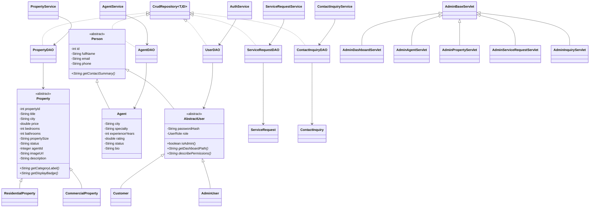

# Class Diagram (Mermaid)

```mermaid
classDiagram
    class Person {
        <<abstract>>
        -int id
        -String fullName
        -String email
        -String phone
        +String getContactSummary()*
    }

    class AbstractUser {
        <<abstract>>
        -String passwordHash
        -UserRole role
        +boolean isAdmin()
        +String getDashboardPath()*
        +String describePermissions()*
    }

    class Customer
    class AdminUser
    class Agent {
        -String city
        -String specialty
        -int experienceYears
        -double rating
        -String status
        -String bio
    }

    class Property {
        <<abstract>>
        -int propertyId
        -String title
        -String city
        -double price
        -int bedrooms
        -int bathrooms
        -String propertySize
        -String status
        -Integer agentId
        -String imageUrl
        -String description
        +String getCategoryLabel()*
        +String getDisplayBadge()*
    }

    class ResidentialProperty
    class CommercialProperty
    class ServiceRequest
    class ContactInquiry
    class CrudRepository~T,ID~
    class AgentDAO
    class PropertyDAO
    class ServiceRequestDAO
    class ContactInquiryDAO
    class UserDAO
    class AuthService
    class AgentService
    class PropertyService
    class ServiceRequestService
    class ContactInquiryService
    class AdminBaseServlet

    Person <|-- AbstractUser
    Person <|-- Agent
    AbstractUser <|-- Customer
    AbstractUser <|-- AdminUser
    Property <|-- ResidentialProperty
    Property <|-- CommercialProperty
    CrudRepository <|.. AgentDAO
    CrudRepository <|.. PropertyDAO
    CrudRepository <|.. ServiceRequestDAO
    CrudRepository <|.. ContactInquiryDAO
    CrudRepository <|.. UserDAO
    UserDAO --> AbstractUser
    AgentDAO --> Agent
    PropertyDAO --> Property
    ServiceRequestDAO --> ServiceRequest
    ContactInquiryDAO --> ContactInquiry
    AuthService --> UserDAO
    AgentService --> AgentDAO
    PropertyService --> PropertyDAO
    ServiceRequestService --> ServiceRequestDAO
    ContactInquiryService --> ContactInquiryDAO
    AdminBaseServlet <|-- AdminDashboardServlet
    AdminBaseServlet <|-- AdminAgentServlet
    AdminBaseServlet <|-- AdminPropertyServlet
    AdminBaseServlet <|-- AdminServiceRequestServlet
    AdminBaseServlet <|-- AdminInquiryServlet
```
